**Assignment 1 – Practical Deep Learning Workshop**

**Part 1 - Data analysis:**

We have chosen the "Birds species" dataset.

**a.**  	 The dataset consists of 87874 images - 81950 for training, 2575 for validation and   2575 for testing.

**b.**  	Each Image in the dataset has various dimensions, with 3 channels. There are 515 classes. Since the images have already been cropped and processed there isn’t much need for preprocessing besides resizing the samples into the same size of 224 x 224 x 3 and then transforming them into tensors. We can use augmentations on the samples, for example moving each pixel to the right random steps,blur image and more.

**c.**   	The dataset is imbalanced, with some classes having more samples than others. The class with the highest number of samples contains 273 instances, while the class with the lowest number of samples contains only 140 instances. On average, there are 172 samples per class.

**d.**  	We have found several outcomes from different methods. One notebook on Kaggle utilizing VGG16 achieved an accuracy of 99%. Additionally, we found a notebook implementing InceptionResNetV2 that resulted in an accuracy of 94%, and another notebook using MobileNet with an accuracy of 98%.

**e.**  	Given the size of the dataset, which comprises 515 classes, it is not feasible to present an image from each class. To provide a representative sample of the dataset, we present a selection of example images below:

An example of classes that we consider to be difficult to separate is the group of three duck classes, namely, "Wood duck", "Teal duck", and "Mallard duck", due to their similar physical characteristics and similar background surroundings:

In contrast, we find that distinguishing between the three classes of "Kiwi", "Snowy owl", and "Peacock" is relatively straightforward due to their distinct physical characteristics:

**Part 2 - Forming our own neural network**

In this section , we have built our very own neural network with pytorch lightning.

Our model is composed of 4 convolutional layers,dropout,2 max poolings and 2 linear layers.

During Our Experiments we have used 5-Fold validation with 10 epochs each ,1e-4 learning rate and batch size of 64.

As we have finished our training , we want to get a visual sense of how our model behaves.Therefore, we would like to print examples of good and bad classifications.

That way, we can figure out if our model has a type of photos that it classifies badly.

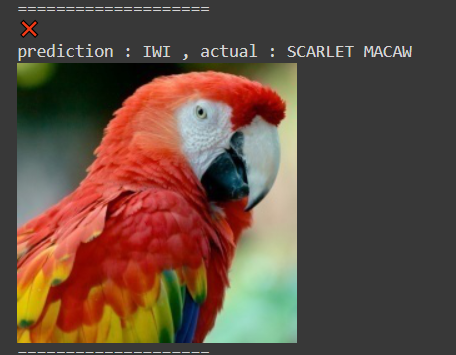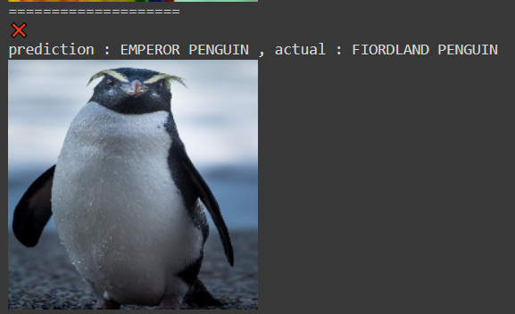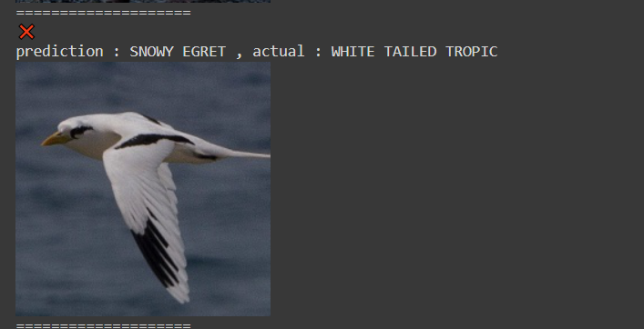

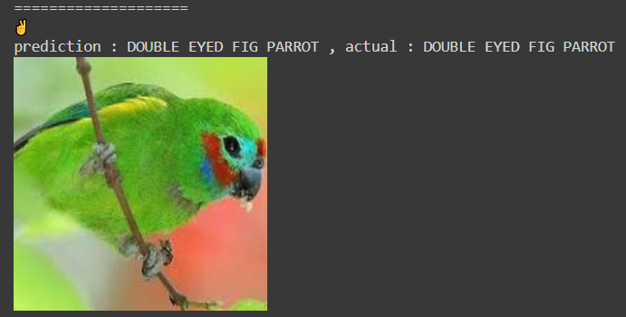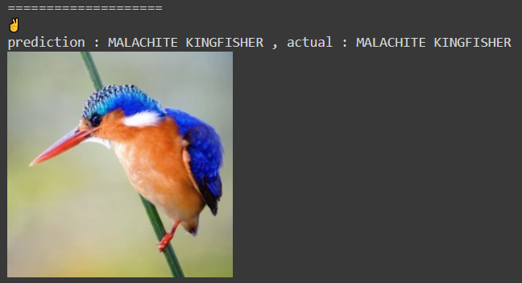

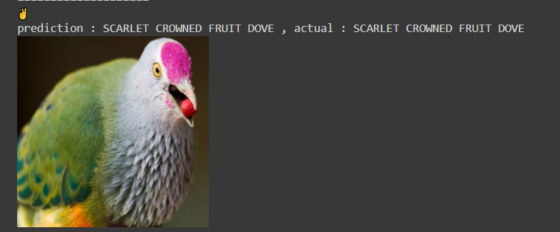

During the training, we have logged training loss,validation accuracy and validation loss Along with test accuracy and test loss.

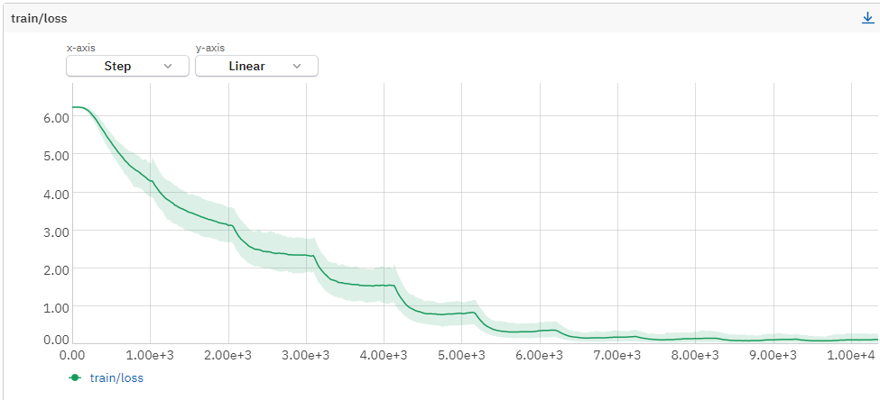

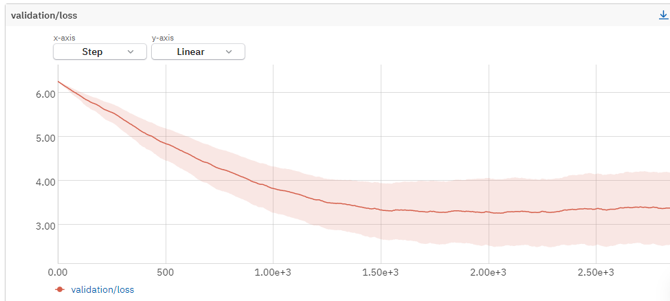

we can see here one of the folds cross entropy loss metric. We can clearly see that the training loss is getting to a really small value,but the validation loss is not. The main reason for that can be the simplicity of the model ,maybe the learning rate is too low or maybe the batch size is too high.

you can see all 5 folds data in the following links:

[DEEP1-336 (neptune.ai)](https://new-ui.neptune.ai/harelmx/deep-hw1/runs/details?viewId=98d38da2-6b13-4460-a826-def65f0ca3f6&detailsTab=charts&shortId=DEEP1-336&type=run)

[DEEP1-337 (neptune.ai)](https://new-ui.neptune.ai/harelmx/deep-hw1/runs/details?viewId=98d38da2-6b13-4460-a826-def65f0ca3f6&detailsTab=charts&shortId=DEEP1-337&type=run)

[DEEP1-338 (neptune.ai)](https://new-ui.neptune.ai/harelmx/deep-hw1/runs/details?viewId=98d38da2-6b13-4460-a826-def65f0ca3f6&detailsTab=charts&shortId=DEEP1-338&type=run)

[DEEP1-339 (neptune.ai)](https://new-ui.neptune.ai/harelmx/deep-hw1/runs/details?viewId=98d38da2-6b13-4460-a826-def65f0ca3f6&detailsTab=charts&shortId=DEEP1-339&type=run)

[DEEP1-340 (neptune.ai)](https://new-ui.neptune.ai/harelmx/deep-hw1/runs/details?viewId=98d38da2-6b13-4460-a826-def65f0ca3f6&detailsTab=charts&shortId=DEEP1-340&type=run)

the mean accuracy for all the folds is 0.35211071372032166

As we mentioned, we could improve our model performance by modifying some hyperparameters and make the model more complex. 

so we have set the batch size to 32 and added a linear layer.

here are the results of this network with 10 epochs:

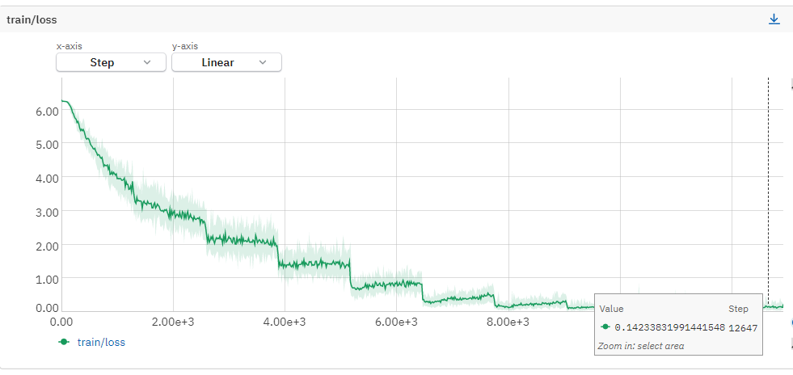

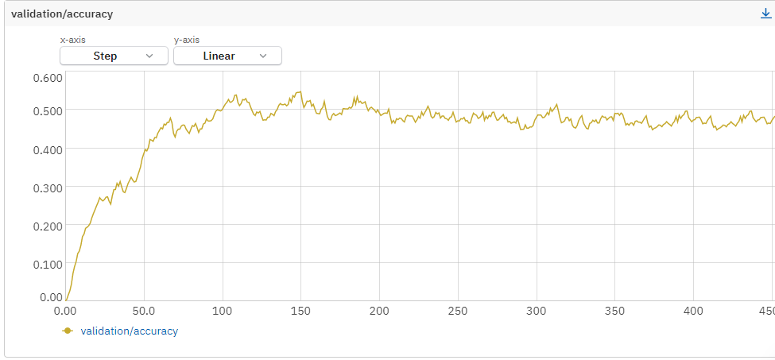

we can see that the network performs a little bit better but still gets stuck after a 100 steps, probably because the network is still small.

We also have implemented an inference time augmentation  . inference time augmentation is supposed to reveal our model weaknesses to mild changes to the data. lets say that most of our data images are birds that are in the middle of the photo. Our model may learn the concept of location in the photo and will be less accurate when dealing with birds photos that are not centered.

We have learned in Natis office hours that this method is also supposed to make models' performances more extreme. weak models will get lower performances and strong ones will get better ones.

We have implemented AugMix augmentation which blurs the image.

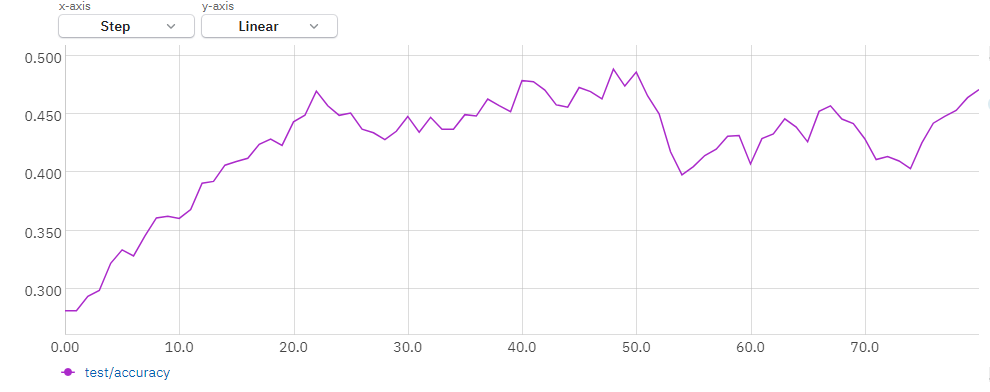

Here you can see our model got poorer performance then the evaluation without inference time augmentation(the improved version) ,which means the model is not a really good one, we suppose due to its simplicity. 

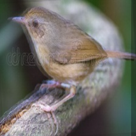

**All neptune logs for this section: ****[https://new-ui.neptune.ai/harelmx/deep-hw**1](https://new-ui.neptune.ai/harelmx/deep-hw1)

**Part 3 - Transfer learning:**

For the third part we were tasked with using pre-trained models for the classification. 

We used the same dataset - 515 bird species, which is divided into three subsets: train, validation and test. Since the samples are already preprocessed we did not need to make any major transformations. 

The four pre-trained models we chose are Efficientnet_B0, VGG16, AlexNet and GoogLeNet. All four of these models were trained on the ImageNet dataset. 

In order to specify these models to our problem, we used the steps for adapting a pre-trained model to a new task. Firstly, for each model we replaced the classifier layer with two linear layers and one ReLU activation layer that resulted in an output of 515 to match our classes. Secondly, we froze all of the layers except the ones we replaced the classifier with. 

To fit our models, we firstly trained only the layers of the new classification. afterwards we unfroze all the other layers and trained the entire model again for a few additional epochs. 

We experimented with adding augmentation to the data, and changing the hyper-parameters. Eventually we got the best results without any augmentation. We used a batch size of 32, a learning rate of 0.0001. We trained our new classification layers with one epoch and then we trained the entire model with an additional 10. 

Overall, EfficientNet got the best results with a test accuracy of 0.988, followed by GoogLeNet with 0.976, then VGG16 with 0.959 and finally AlexNet with 0.937.

Here are the some results for efficientnet_B0 which performed the best:

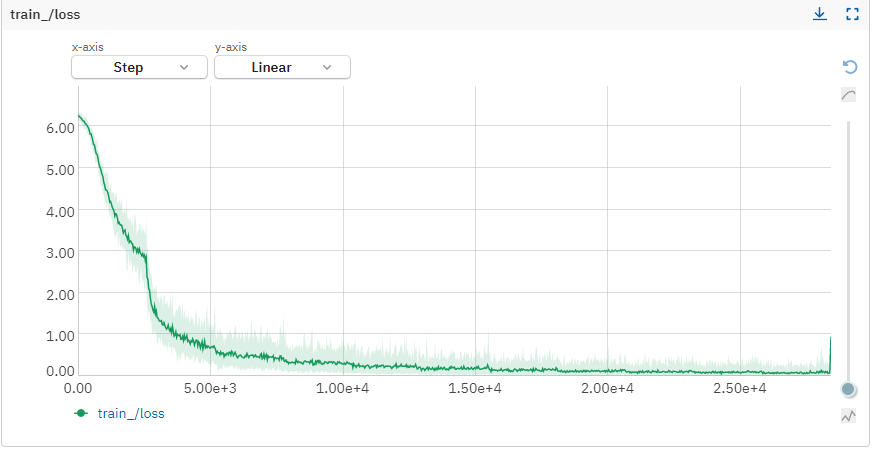

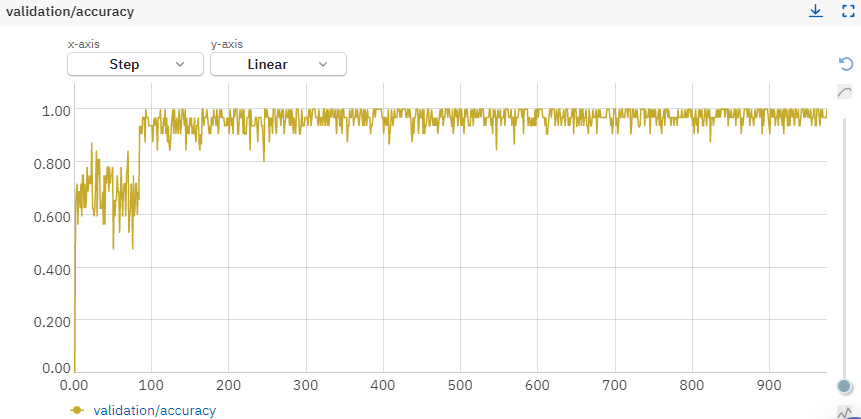

We can see a major improvement in the model after we unfreeze all layers, without much change between each epoch. 

We can look at the results for AlexNet who performed the worst:

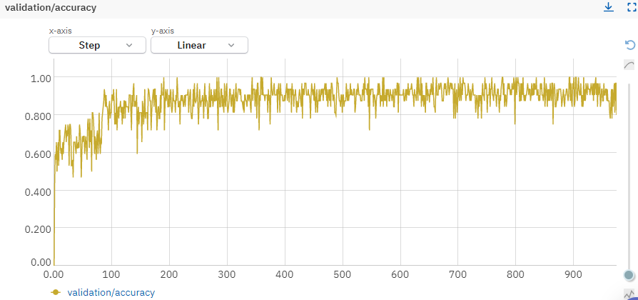

As we can see, this model converges more slowly. There's also an improvement after unfreezing all layers, but it’s not as drastic as EfficientNet. 

**c. **This table summarizes our results for each model:

<table>
  <tr>
    <td>Model Name</td>
    <td>parameters</td>
    <td>Validation Loss</td>
    <td>Validation Accuracy</td>
    <td>Test Loss</td>
    <td>Test Accuracy</td>
    <td># unique correct samples</td>
    <td># unique errors</td>
  </tr>
  <tr>
    <td>1. Efficientnet_B0</td>
    <td>6.3 M</td>
    <td>0.116</td>
    <td>0.976	</td>
    <td>0.039</td>
    <td>0.988</td>
    <td>1</td>
    <td>0</td>
  </tr>
  <tr>
    <td>2. VGG16</td>
    <td>47.5 M</td>
    <td>0.249</td>
    <td>0.940</td>
    <td>0.135</td>
    <td>0.959</td>
    <td>1</td>
    <td>3</td>
  </tr>
  <tr>
    <td>3. AlexNet       </td>
    <td>14.9 M</td>
    <td>0.346</td>
    <td>0.914</td>
    <td>0.201</td>
    <td>0.937</td>
    <td>0</td>
    <td>7</td>
  </tr>
  <tr>
    <td>4.GoogLeNet</td>
    <td>7.2 M</td>
    <td>0.163</td>
    <td>0.953</td>
    <td>0.088</td>
    <td>0.976</td>
    <td>1</td>
    <td>1</td>
  </tr>
</table>

In order to use one of the models as a feature extractor, we used a dumbed down version of our Efficientnet model. Instead of three layers in the classifier we used a single linear layer and trained it with only one epoch. We did this because we got bad results using the fine-tuned models, possibly because they are too overfitted for this task.

We removed our classification layer and extracted the training and testing features using the model. Finally, we trained and tested a Random Forest classifier with the extracted feature, which gave us an accuracy of 0.966.

**e.**

Experiments for using pretrained models.

<table>
  <tr>
    <td>Experiment</td>
    <td>Description</td>
  </tr>
  <tr>
    <td>1)  	Running the pretrained efficientnet model with no further fine-tunning other than changing the classifier to one layer</td>
    <td>For this experiment we tried to test the model with no changes, we used a batch size of 16, no transformations other than changing the size of the photos to 224x224, a learning rate of 0.0001.  we replaced the last layer of the model with a linear layer with an input of 1280 and output of 515.
The test loss was 0.306 and the test accuracy was 0.934. The runtime was 4m 49s. *Note – we did the same with the 3 other models to compare results</td>
  </tr>
  <tr>
    <td>2)  	Adding augmentation to the data</td>
    <td>Efficientnet with data augmentation – horizontal Flip and random Rotation. We used the same parameters as the previous experiment. Training loss of 0.305 and accuracy of 0.937, runtime was 7m 7s.</td>
  </tr>
  <tr>
    <td>3)  	Same attributes as experiment 1 but with 30 epochs</td>
    <td>The only change was the number of epochs - test loss of 0.048 and test accuracy of 0.98. runtime was 2h 46m. *Note – we did the same with the 3 other models to compare results</td>
  </tr>
  <tr>
    <td>4)  	Added additional layers to the classifier</td>
    <td>We added additional layers to the classifier and froze the original model layers for the training. The number of epochs was 1, test loss was 2.47, test accuracy was 0.75 and the runtime was 4m 35s.</td>
  </tr>
  <tr>
    <td>5)  	Added additional layers without freezing the original model</td>
    <td>Same as experiment 3 but we trained all the weights and not just those of the classifier. Test loss was 0.151 and test accuracy was 0.9704.</td>
  </tr>
  <tr>
    <td>6)  	Transfer learning as suggested in the lecture</td>
    <td>We used the data without any augmentation and a batch size of 32. We changed the classifier of the model with multiple layers: dropout with a value of 0.5, a linear layer with an input and output of 1280, ReLu, dropout with a value of 0.5 and a final linear layer with an input of 1280 and output of 515.
We froze the original model weights and trained the model with one epoch. Afterwards we unfroze the weights and lowered the learning rate to 0.00001 and trained the model with an additional 10 epochs. The train loss was 0.048, train accuracy was 0.989 and runtime was 45m 44s.</td>
  </tr>
</table>

Experiments for using pretrained models as feature extractors for a classic ML algorithm

<table>
  <tr>
    <td>Experiment</td>
    <td>Description</td>
  </tr>
  <tr>
    <td>1)  	Random Forest with VGG16 – 30 epochs</td>
    <td>We trained sklearn random forest model using our VGG16 without fine tunning after 30 epochs as a feature extractor. We set n_estimators to 50, max_depth to 100 and random_state to 42. We got an accuracy of 0.1844</td>
  </tr>
  <tr>
    <td>2)  	Random Forest with VGG16 – 1 epoch</td>
    <td>Same as experiment 1 but we used the VGG16 model after only one epoch. We got an accuracy of 0.274</td>
  </tr>
  <tr>
    <td>3)  	Random Forest with VGG16 with fine tunning</td>
    <td>Same as experiment 2 but we added additional layers to the classifier and froze the original model layers during the training. We got an accuracy of 0.1766.</td>
  </tr>
  <tr>
    <td>4)  	Random Forest with GoogLeNet</td>
    <td>We used efficientnet with one epoch without fine tunning with the max_depth of 150. We got an accuracy of 0.05.</td>
  </tr>
  <tr>
    <td>5)  	Random Forest with efficientnet</td>
    <td>We used efficientnet with one epoch without fine tunning with the max_depth of 150. We got an accuracy of 0.966.</td>
  </tr>
</table>

**All neptune logs for this section: ****[https://new-ui.neptune.ai/sadotal/ML-task**1](https://new-ui.neptune.ai/sadotal/ML-task1)

