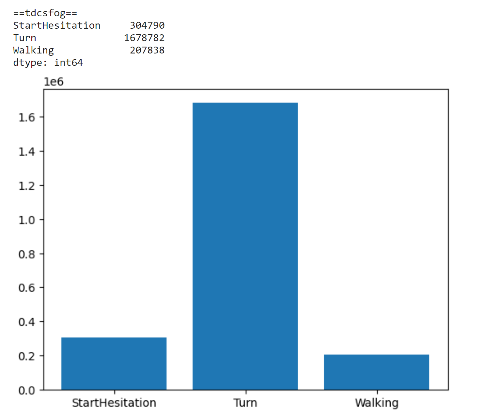

**Assignment 2 – Practical Deep Learning Workshop**

abstract

The data we dealt with in this assignment came from a series of experiments carried out with experimenters with Parkinson's disease. The phenomenon of Freezing of gait (FOG) is a common phenomenon among Parkinson's patients (statistics show that half of the patients experience the phenomenon). As part of the phenomenon, the patient feels stuck to the floor and is unable to perform simple tasks including turning, walking in a straight line and opening doors. The above experiments were carried out in 3 situations. The first experiment was in the laboratory, when the experimenters performed a test called the FOG-provoking protocol. This experiment was recorded in a dataset called tdcsfog. The second experiment was carried out in the experimenters' home and the same test was performed there, this experiment was recorded in a dataset called defog. The third experiment We will last a week, during the experiment the activity of the experimenters was monitored with the help of sensors attached to their lower backs (these sensors were also used in the first 2 experiments). The third experiment was recorded in a dataset called daily . The first experiments were photographed and observed by experts. For moments when the experimenter experienced FOG according to the expert, the phenomenon was recorded At that moment. The goal of our work is to predict when there was a FOG event according to the sensor data and what kind of event it is (between general hesitation, stalling while turning or stalling while walking).

Part 1 - data exploration

a. 

**i**.  The data is taken from the series of experiments mentioned above, it is not homogeneous. For example, in the notype folder, the FOG events are recorded but it is not specified which event it is. Unlike defog and tdcsfog where the type of event was recorded (StartHesitation, Turn, Walking). Furthermore, the information in noType is taken in an experiment done in the subjects homes and noType/defog was in a lab.

**ii**. The data was tagged with the help of experts on the phenomenon who watched video recordings collected from the experiments.

**iii**. As mentioned above, in some folders the information is labeled differently and in a less detailed form than the others, therefore more weight should be given to more detailed labeling.

In addition, there are labels that were not unambiguous, therefore in the notype folder there is the Valid column that describes whether the labeling is unambiguous or not. That's why not all labeling is valid.

**iv**. 65 people participated in the experiments. The information is divided into train/test in such a way that in test there are 250 series of records in which there are subjects who are not in the training set.

b.

The task we are facing is classification ,we have 3 classes that are 3 different FOG events.lets explore the data:

distribution of the classes for each dataset:

We can see that the most common phenomenon of FOG events is Turning .

Another interesting thing that we have seen is the ratio of events to non events records in defog+tdcsfog datasets

We can see the massive imbalance of the classes. We will need to handle it in pre-processing.

More analytics and charts can be found in the `data exploration` notebook and in the pre-processing section below.

c.

1. Average each feature (AccV,AccML,AccAP) and try to predict for each feature if its above or below his average.

2. Delete sections of the time series and try to predict them.

2.

In this section we will try to train models to perform said task. To do so we will first need to pre process the data.

Pre processing

* We have noticed that the data measured at the subject homes and the data from the lab are measured differently (g vs a) . Due to that  we have scaled the defog data by 1/g .

* The data of deFog and tscsFog has different ranges so we have activated min max norm on all the data.

* The data is very big. training a model on a dataset this big can take a lot of time. In addition, we have an imbalance data problem,the rate of events is 0.31. To handle these 2 problems we have constructed the following solution. we have located the records indexes that had 1 label at least for one of the labels. for each located section (that is a section that a certain event has occurred),we took a window of 5 seconds in the past and 2.5 seconds ( we took into account that in defog 1 sec is 100 records and in tscsfog 1 sec is 128 records) in the future so our model can focus on the important events and the surrounding time. After this filtering the rate of events was 0.64 so the data is balanced,and more focused.

Another thing that we checked is the correlation between the features before and after the filtering .

We found that after the filtering, the correlation between the features and the targets increased. which means that the filter made it so the feature express better the targets.

After analyzing the acceleration axes and studying video demonstrations of freezing of gait, we observed that the subjects tend to lean forward during the event. 

Based on this finding, we decided to incorporate an additional feature into our model, which calculates the inverse tangent of AccAP and AccV to provide the angle of the subject. This will enable the model to use this angle as a significant input in its training process.

As each dataset was divided by the experiment's ID, and each experiment had only one subject, we decided to split our data in a way that kept each experiment as a whole. This meant that no part of the same experiment would appear in both the training and validation sets. Additionally, we ensured that no subject appeared in both sets.

We divided our data in a way that preserved the distribution of our target

columns while splitting the data to around 75% for training and 25% for validation. 

1. We created a naïve baseline solution by using the class distribution of the target columns. We predicted the majority class for all samples in the training and validation sets.

To see how this solution performs we calculated the MAP score for predicting the entire datasets, and got the value of 0.0898.

2. We tested the results of two different classical machine learning models: Random Forest Classifier and KNeighbors Classifier. For each one of these models we used the same data sets as we used for our neural network models, so we could compare the results and evaluate the networks accordingly.

Results for Random Forest - MAP score: 0.2731

Results for KNeighbors  -  MAP score: 0.2761

The training was done using the train data frame and the testing was done on our validation data frame. We can see that these models gave very similar scores, both better than the naïve baseline.

3. In this section we have trained a LSTM model and a 1 dimensional CNN

**1D-CNN**

Our CNN includes 3 convolutional layers with batch normalization after each layer,2 linear layers and a dropout layer. We have noticed that even after we filtered the data , the training time is very long so we have trained our model with 5 epochs,128 batch size and 1e-4 lr .

We have decided to try our training with 2 visions, one with a training loader that is set on shuffle,and one when the loader doesn't.

.

As you can clearly see, the model with the shuffle loader (pink) is converging faster then the non-shuffle one (red) and also gets better performance on the validation set.

 Our model (the shuffled one) showed good performance after only 1 epoch, we assumed that the batch normalization contributed to this quick convergence time.

**LSTM**

Our LSTM-model architecture consists of an LSTM layer followed by two fully connected layers. The LSTM has a hidden-size of 128 and two layers with a dropout of 0.5. The output of the LSTM is passed through the two linear layers.  The model uses cross-entropy as the loss function, Adam optimizer and a learning rate of 1e-4. 

4.  

We decided to implement our first self-supervised task, in which we calculated the average of all three acceleration axes and used the values as targets in each time sample.

**1D-CNN**

For this model, we fine tuned the model on the task mentioned above.

We took the CNN model that we have trained with our objective classification task.

We have set a new classifier for the model so he can predict the mean value of each feature (3 features,3 targets).

After convergence, we have compared the result of the cnn model (original one) with the cnn_mean model (fine tuned one) with precision metric. The cnn model achieved 0.299 precision and the fine tuned model (cnn_mean) got 0.86 (!).

**LSTM**

We started training our model on the self-supervised data set, and then changed our classifier layer to match the main classification targets. The LSTM model without the additional supervised task achieved 0.2775 precision. With pre-training the model achieved an accuracy 0.2766, meaning that the self supervised task of this kind may not be the best choice for this model.

These graphs show the training process on the new task. while the loss appears to be converging during training, the validation results are not great.

In this graph we compare the training loss with pre training and without. Although using the self supervised task did help with the learning rate and started from a lower loss, it didn’t end up with better results than using the normal model without the task.

f.

we have analyzed our models abilities to predict each class:

Normal CNN

Fine tuned CNN

LSTM

when 0 is no event ,1 is StartHesitation ,2 is Turn and 3 is Walking

1. We noticed that our models are succeeding to converge rather quickly, so increasing the learning rate might be a way to accelerate the learning even more.

2. Increasing the batch size of the training could help with efficient computation of gradients and speed up the learning process. 

3. Since we trained our models on data windows based on the position of the events, there is a chance that the model would learn these positions which would cause overfitting. Adding regularization to the model could help prevent this happening.

g. 

**1D-CNN**

We have tried to improve our model performance with 2 other versions.

1. increase batch size from 128 to 256 (yellow)

2. increase learning rate to 1e-3,batch size 128 (green)

As we can see , increasing the learning rate improved the convergence time.

	

	

	**LSTM**

**	**We tried to improve our performance in a similar way in our LSTM model:

1. Increase batch size from 1e-4 to 1e-3 (red).

2. Adding regularization to the model (green).

